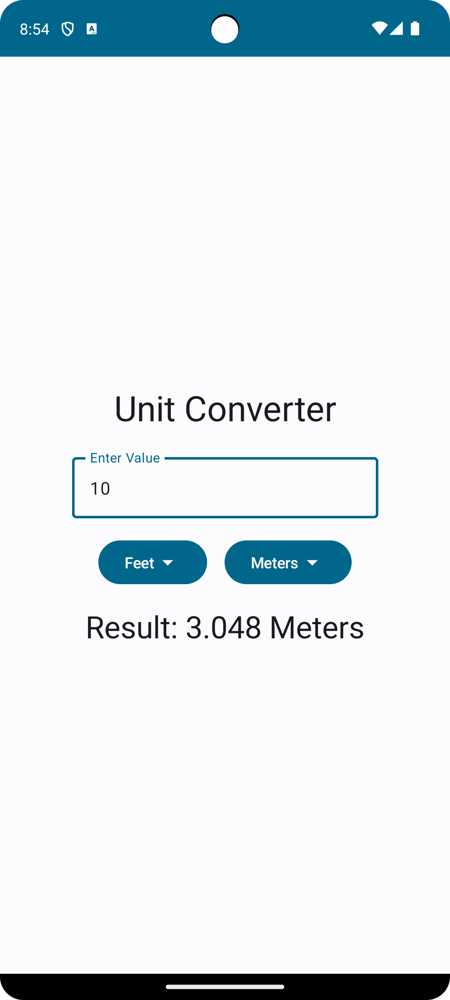

# Unit Converter

Unit Converter is a simple Android application that allows users to convert values between different units of measurement.

## Features

- Convert values between meters, centimeters, millimeters, and feet.
- User-friendly interface with dropdown menus for selecting input and output units.
- Real-time conversion as the user inputs values.

## Screenshots

    

## How to Use

1. Launch the Unit Converter application on your Android device.
2. Enter the value you want to convert in the input field.
3. Select the input unit from the dropdown menu.
4. Select the desired output unit from the dropdown menu.
5. The converted value will be displayed automatically.

## Technologies Used
- **Android Studio**: IDE for Android app development.
- **Kotlin**: Programming language used for building the app.
- **Jetpack Compose**: Jetpack Compose is Android’s recommended modern toolkit for building native UI.

## Installation
1. Clone the repository to your local machine.
2. Open the project in Android Studio.
3. Build and run the application on an Android device or emulator.